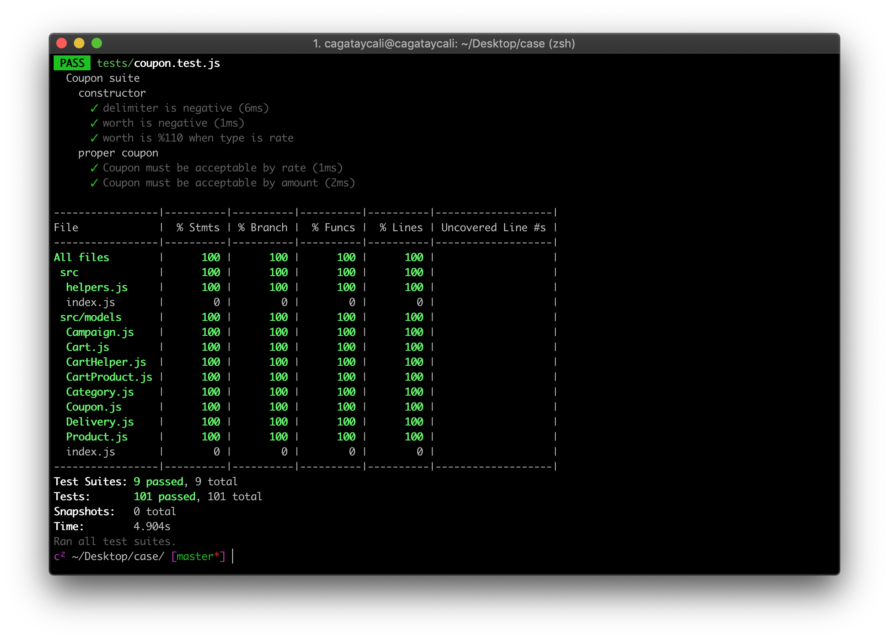

# Shopping Cart Implementation (OOP, TDD, vice versa)

[](https://travis-ci.org/cagataycali/case) [](https://coveralls.io/github/cagataycali/case?branch=master)
----

This repository contains a CLI app which provides following abilities;
* Create cart,
* Add - remove products to cart which belongs categories,
* Create category may have parent,
* Calculate delivery cost dynamically given params.




# :rocket: Installation

```
npm i -g ccase;
ccase
```

# :books: Docs

> Implementation is fully documented with [JSDoc](https://devdocs.io/jsdoc/),

[Documentation](https://cagatay.js.org/case/)
